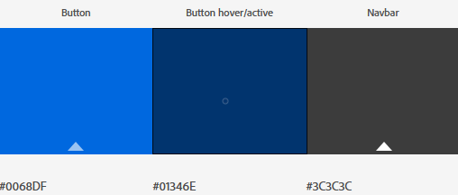
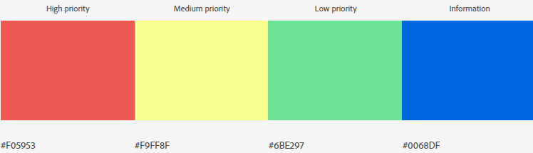

<h1 align="center">Helpdesk-Micro</h1>

<h2 align="center"></h2>

[View the live project here.](http://helpdesk-micro.herokuapp.com/)

Using HTML, CSS, JavaScript, Python, Flask and MongoDB, Helpdesk-Micro is designed for small internal IT teams to be able to log and manage Helpdesk tickets for their organisation. 

Primarily designed desktop focussed website, Heldesk-Micro is also responsive on smaller screens.  Users are able to create Helpdesk tickets, add and delete updates to those tickets.  Users will also be able to add, edit and delete both end users and administrative users. The website is inaccessible without a login.

## Contents
1. [**UX**](#UX)
    -  [**User Stories**](#user-stories)
    -  [**Design**](#design)
    -  [**Wireframes**](#wireframes)
2. [**Features**](#features)
    -  [**Existing Features**](#existing-features)
    -  [**Features To Add In The Future**](#features-to-add-in-the-future)
3. [**Technologies Used**](#technologies-used)
    -  [**Languages Used**](#languages-used)
    -  [**Frameworks, Libraries and Programs Used**](#frameworks-libraries-and-programs-used)
5. [**Schema Design**](#schema-design)
8. [**Testing**](#testing)
    -  [**Tools**](#tools)
    -  [**Testing User Stories**](#testing-user-stories)
9. [**Deployment**](#deployment)
    -  [**Deploying to Heroku**](#deploying-website-to-heroku)
    -  [**Clone & Run Locally**](#)
10. [**Secret Key & Key Variables**](#secret-key-&-key-variables)
11. [**Design**](#design)
12. [**Credits**](#credits)
13. [**Acknowledgements**](#acknowledgements)

## User Experience (UX)

-   ### User stories

    -   #### User Goals

        1. As a user of the website, I want easily manage, create and complete IT Helpdesk calls for my organisation.
        2. As a user of the website, I want to be able to update helpdesk tickets with additional information and view all previous updates.
        3. As a user of the website, I want to be able to add, view, update and delete members of the organisation's staff.
        4. As a user of the website, I also want to be able to add, view, update (including login details) and delete members of the Administrators team who have access to this site and are able to perform all of the above actions.

-   ### Design
    -   #### Colour Scheme
        - ##### Navbar and buttons
            The site uses two primary, contrasting colours to help keep buttons(#0068DF) and navbar(#3C3C3C) defined and easily distinguishable. A third darker blue(#01346E), is used for buttons when active or hovered.


        - ##### Call priority status
            Each call can be created or edited to have one of four levels of importance - High(#f05953), Medium(#f9ff8f), Low(#6be297) and Information(#0068df).  This status is reflected in each ticket's collapsible header to allow users to determine the ticket's importance at a glance.

        - ##### Background
            Random backgrounds are applied on each page refresh.  A selection of images taken from nature are used.  As the site is relatively text based this adds visual interest to the site without detracting from it's primary purpose. 
    -   #### Typography
        -   There is one primary font for the website - Kumbh Sans. Sans Serif is used as the fallback font, in case for any reason, the fonts aren't being imported into the site correctly. Kumbh Sans is a Geometric Sans Serif multi-purpose font which remains legible for large amounts of text and renders well on smaller screens. 

   ### Wireframes

    -   Ticket view Wireframe for Desktop & Mobile - [View](https://##)

    -    - [View](https://##)

    -    - [View](https://##)

## Features

-   ### Existing Features

-   Responsive on all device sizes: Although designed primarily for desktop users, the site can be used and viewed on smaller screens, so an Administrative user can view, add, delete and update in all areas of the site if they are working away from their desktop at a users desk for example.
-   Tickets by view: Administrative users are able to view tickets by status of 'Open', 'On hold', 'Closed' and 'All'.  Tickets are set to show by date order in all instances, with the newest tickets showing at the top.
 

-   ### Future Features

-   Dashboard to be able to view stats - current number of call open, closed today etc.
-   Export data as .csv to enable Administrators to use for reporting.
-   The ability for end users to be able to raise tickets by send email and the ability to send updates to end users.

-   ### Defensive Design

-   Secure login: All parts of the site, aside from the initial login page are only accessible to Administrative users that have been provided a login.  This is due to the fact that the helpdesk tickets will contain company sensitive information such as email addresses, contact names and contact telephone numbers which should not be visible to anyone outside of the organisation.
-   Administrative users are unable to delete their own account.  This is to stop someone being able to login and delete all Administrative users and therefor blocking login to the site.
-   Administrative users are only able to delete their own updates on tickets.
-   All delete actions are prefaced by a confirmation modal to stop accidental deletion.

## Technologies Used

### Languages Used

-   [HTML5](https://en.wikipedia.org/wiki/HTML5)
-   [CSS3](https://en.wikipedia.org/wiki/Cascading_Style_Sheets)
-   [JavaScript](https://en.wikipedia.org/wiki/JavaScript)
-   [Python](https://www.python.org/)

### Frameworks Libraries and Programs Used

1. [Flask:](https://flask.palletsprojects.com/en/1.1.x/)
    - Flask is a micro web framework written in Python.
1. [MongoDB Atlas:](https://www.mongodb.com/cloud/atlas)
    - MongoDB Atlas is a cloud database service.
1. [Materialize 1.0.0:](https://materializecss.com/getting-started.html)
    - Materialize was used to assist with the responsiveness and styling of the website.
1. [Google Fonts:](https://fonts.google.com/)
    - Google fonts are used to import the 'Kumbh Sans' font into the style.css file which is used on all pages throughout the project.
1. [jQuery:](https://jquery.com/)
    - jQuery came with Materialize to make the navbar responsive.
1. [Git](https://git-scm.com/)
    - Git is used for version control by utilizing the Gitpod terminal to commit to Git and push to GitHub.
1. [GitHub:](https://github.com/)
    - GitHub is used to store the projects code after being pushed from Git.
1. [Gitpod:](https://gitpod.io/)
    - Gitpod was used as the IDE for creating the project.
1. [Heroku:](https://www.heroku.com/)
    - Gitpod was used as the IDE for creating the project.

## Schema Design

## Testing

### Tools

The W3C Markup Validator and W3C CSS Validator Services were used to validate the HTML and CSS of the project. No errors were found.

-   [W3C Markup Validator](https://validator.w3.org/#validate_by_input)
-   [W3C CSS Validator](https://jigsaw.w3.org/css-validator/#validate_by_input)

The Esprima JavaScript Syntax Validator & JSHint were used to validate the JavaScript of the project. No errors were found.

-   [Esprima JavaScript Syntax Validator](https://esprima.org/demo/validate.html)
-   [JSHint](https://jshint.com/)

The PEP8 Online & ExtendsClass Python Syntax Checker were used to validate the Python of the project. No errors were found.

-   [ExtendsClass Python Syntax Checker](https://extendsclass.com/python-tester.html)
-   [PEP8 online](http://pep8online.com/)

Lighthouse in Chrome Devtools was used to test website performance, bestpractices, accessibility and SEO 

-   [Lighthouse](https://developers.google.com/web/tools/lighthouse)

### Testing User Stories

-   #### User Goals

    1. As a user of the website, I want easily manage, create and complete IT Helpdesk calls for my organisation.

        -   Upon entering the site, after login, users are greeted with a clean and easily readable navigation bar and a list of all open helpdesk tickets.

    2. As a user of the website, I want to be able to update helpdesk tickets with additional information and view all previous updates.

        -   There are two methods to add an update to an existing ticket.  There is a 'quick update' button accessible once a ticket has been expanded in any of the four main views - all open, all held, all closed and all tickets.  The second method of adding an update is the 'new update' button that is visible after clicking the 'all updates' button in the expanded ticket view. The 'all updates' button also allows a user to see all previous updates that ave been added to that ticket. 

    3. As a user of the website, I want to be able to add, view, update and delete members of the organisation's staff.

        -   All exsting staff members are visble once a user has navigated to the 'All end users' page from the navigation bar.  This page shows a card for each end user and contains important information such as end user name, mail address, telephone number and department. The card also has edit button should an end users information require amending. The delete button, also available on the user card allows deletion of that user should they no longer be required.

        -   Also availble from the navigation menu is 'add end user'. This page contains a form with fields for name, email address, telephone number and department. Submitting this form creates a new end user record. 

    4. As a user of the website, I also want to be able to add, view, update (including login details) and delete members of the Administrators team who have access to this site and are able to perform all of the above actions.

        -   All exsting Admin members are visble once a user has navigated to the 'All admin users' page from the navigation bar. This page shows a card for each Admin user.  The card also has edit button should an Admin users name or password require amending.  The delete button, also available on the Admin user card allows deletion of that user should they no longer be required. An Admin user is unable to delete their own card as the delete button is removed for the logged in user.

### Further Testing

-   The website was tested on Google Chrome, Internet Explorer, old Microsoft Edge, new Microsoft Edge and Mozilla Firefox browsers for desktop. In each of the browsers, the following were tested to ensure functionality:

    -   Login & logout
    -   Create and edit tickets
    -   Create, edit and delete end users
    -   Create, edit and delete Admin users
    -   Create and delete ticket updates

-   The website was tested on Google Chrome, Safari, Samsung Internet and Amazon Silk on mobile devices. In each of the browsers, the following were tested to ensure functionality:

    -   Login & logout
    -   Create and edit tickets
    -   Create, edit and delete end users
    -   Create, edit and delete Admin users
    -   Create and delete ticket updates   

-   The website was viewed on a variety of devices such as Windows Desktop, Windows Laptop, Samsung S8, Samsung S20, Samsung S3 tablet, Motorola G4, Amazon Fire, iPhone7, iPhone 8.
-   All text input fields were tested with no text, quantities of text that did not meet minimum length requirements and quantities of text exceeding the maximum length requirements.  For fields labelled as required, the correct response was returned by the browser. For minimum and maximum requirements the expected tooltip response was returned by the browser.
-   For the creation and edit of Admin passwords the pattern and length requirements were tested by attempting to create a password with one required type missing and length not being met. In each instance, browser tooltips were presented with the correct response and the form could not be completed.
-   For login, an incorrect username and incorrect password were supplied to the login form.  The expected 'invalid credential' flash message was shown on each incorrect attempt.
-   The search function located in the navigation bar was tested with single characters, special characters and paragraphs of text.  The expected response was returned each time.  If results were available they would be returned, if there were no results the correct warning would be presented to the user.
-   The contact form located in the 'about' modal has been tested to ensure that emails are sent through emailJS.  There is currently no confirmation to the end user that email has been sent and the modal closes on form submit. This requires further investigation for a solution.
-   Frequent tests were undertaken after major code changes to ensure cross-browser and cross-device compatibility.
-   Friends and family members of ages ranging from 15 to 73, were asked to review the site and documentation to point out any bugs and/or user experience issues.
-   Google Lighthouse developer tool in Google Chrome dev tools was used to ensure pages meet best practice.

### Known Bugs & Resolutions if Applicable

-   Incrementing ticketid was not repopulating from edit ticket submit.  Resolved by a disabled hidden text input in edit_ticket.html with _ticketid fields.
-   modal for delete end users and admins was causing the first in item in the MongoDB collection to be deleted rather than the chosen object.  This was fixed by referencing the desired item's ObjectId in the data-target in the modal trigger, by giving the modal an id that references ObjectId and giving the modal h4 text the same ObjectId.
-   Backround image does not fill the whole screen when using select drop downs on iOS Safari. This remains unfixed.


## Deployment

### GitHub Pages

The project was deployed to GitHub Pages using the following steps:

1. Log in to GitHub and locate the [GitHub Repository](https://github.com/pengols/HeeeyYooouGuuuys)
2. At the top of the Repository (not top of page), locate the "Settings" Button on the menu.
3. Scroll down the Settings page until you locate the "GitHub Pages" Section.
4. Under "Source", click the dropdown called "None" and select "Master Branch".
5. The page will automatically refresh.
6. Scroll back down through the page to locate the now published site [link](https://pengols.github.io/HeeeyYooouGuuuys/index.html) in the "GitHub Pages" section.

### Forking the GitHub Repository

Forking the GitHub Repository allows a copy of the original repository in GitHub to be created.  The forked repository can be viewed or be changed without affecting the original repository, by using the following steps:

1. Log in to GitHub and locate the [GitHub Repository](https://github.com/pengols/HeeeyYooouGuuuys)
2. At the top of the Repository (not top of page) just above the "Settings" Button on the menu, locate the "Fork" Button.
3. You should now have a copy of the original repository in your GitHub account.

### Making a Local Clone

1. Log in to GitHub and locate the [GitHub Repository](https://github.com/pengols/HeeeyYooouGuuuys)
2. Under the repository name, click "Clone or download".
3. To clone the repository using HTTPS, under "Clone with HTTPS", copy the link.
4. Open Git Bash
5. Change the current working directory to the location where you want the cloned directory to be made.
6. Type `git clone`, and then paste the URL you copied in Step 3.

```
$ git clone https://github.com/YOUR-USERNAME/YOUR-REPOSITORY
```

7. Press Enter. Your local clone will be created.

```
$ git clone https://github.com/YOUR-USERNAME/YOUR-REPOSITORY
> Cloning into `pengols`...
> remote: Counting objects: 10, done.
> remote: Compressing objects: 100% (8/8), done.
> remove: Total 10 (delta 1), reused 10 (delta 1)
> Unpacking objects: 100% (10/10), done.
```

Click [Here](https://help.github.com/en/github/creating-cloning-and-archiving-repositories/cloning-a-repository#cloning-a-repository-to-github-desktop) to retrieve pictures for some of the buttons and more detailed explanations of the above process.

## Credits

### Code

-   [Polyglot.Ninja()](http://polyglot.ninja/auto-incrementing-ids-for-mongodb/) - Auto incrementing IDs for MongoDB.  Code was modified to better fit my needs.

-   [pythonprogramming.net](https://pythonprogramming.net/decorator-wrappers-flask-tutorial-login-required/): For guidance on creating protected pages.

-   Tim at Code Institute Task Manager mini project for guidance on search functionality.

### Content

-   All content was written by the developer.

### Media

-   All background images taken from [Pexels.com](https://www.pexels.com/)


### Acknowledgements

-   My Mentor for continuous helpful feedback.

-   Tutor support at Code Institute for their support.

-   Friends and family for testing and proofing.
